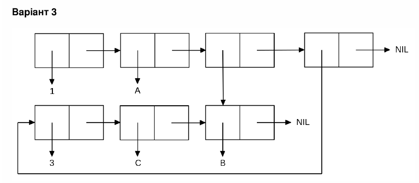

<p align="center"><b>МОНУ НТУУ КПІ ім. Ігоря Сікорського ФПМ СПіСКС</b></p>
<p align="center">
<b>Звіт з лабораторної роботи 1</b><br/>
"Обробка списків з використанням базових функцій"<br/>
дисципліни "Вступ до функціонального програмування"
</p>

<p align="right"> 
<b>Студент</b>: 
<em> Войтенко Іван КВ-21</em></p>

<p align="right"><b>Рік</b>: <em>2025</em></p>

## Загальне завдання

1. Створіть список з п'яти елементів, використовуючи функції LIST і CONS . Форма
створення списку має бути одна — використання SET чи SETQ (або інших
допоміжних форм) для збереження проміжних значень не допускається. Загальна
кількість елементів (включно з підсписками та їх елементами) не має
перевищувати 10-12 шт. (дуже великий список робити не потрібно). Збережіть
створений список у якусь змінну з SET або SETQ . Список має містити (напряму
або у підсписках):
хоча б один символ
хоча б одне число
хоча б один не пустий підсписок
хоча б один пустий підсписок
2. Отримайте голову списку.
3. Отримайте хвіст списку.
4. Отримайте третій елемент списку.
5. Отримайте останній елемент списку.
6. Використайте предикати ATOM та LISTP на різних елементах списку (по 2-3
приклади для кожної функції).
7. Використайте на елементах списку 2-3 інших предикати з розглянутих у розділі 4
навчального посібника.
8. Об'єднайте створений список з одним із його непустих підсписків. Для цього
використайте функцію APPEND.

```lisp
;; Пункт 1 
CL-USER> (setq my-list (list 1 'a '(2 b) () T))
(1 A (2 B) NIL T)

;; Пункт 2 
CL-USER> (car my-list)
1

;; Пункт 3 
CL-USER> (cdr my-list)
(A (2 B) NIL T)

;; Пункт 4
CL-USER> (third my-list)
(2 B)
;або

CL-USER> (nth 2 my-list)
(2 B)

;; Пункт 5
CL-USER> (first (last my-list))
T

;; Пункт 6
;;ATOM
CL-USER> (atom 1)
T
CL-USER> (atom 'A)
T
CL-USER> (atom my-list)
NIL
CL-USER> (atom T)
T
;;LISTP
CL-USER> (listp my-list)
T
CL-USER> (listp 1)
NIL
CL-USER> (listp 'A)
NIL
CL-USER> (listp '(1 2 3))
T

;; Пункт 7
;;EQ
CL-USER> (eq 1 1.0)
NIL
CL-USER> (eq 1 1)
T
CL-USER> (eq '(2 3) `(2 3))
NIL

;;EQUALP
CL-USER> (equalp '(2 3) `(2 3))
T
CL-USER> (equalp 1 1.0)
T

;; Пункт 8
CL-USER> (append my-list (third my-list))
(1 A (2 B) NIL T 2 B)
```

## Варіант 3
<p align="center"></p>

### Лістинг команди конструювання списку та результат її виконанння
```lisp
CL-USER> (setq part_two (list 1 `A (list `B) (list 3 `C `B)))
(1 A (B) (3 C B))
```