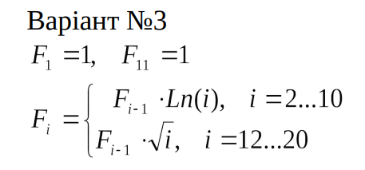
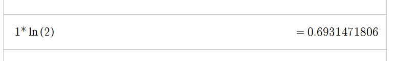
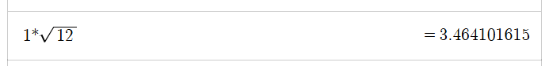
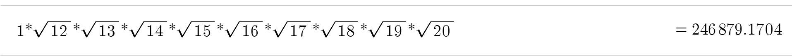

<p align="center"><b>МОНУ НТУУ КПІ ім. Ігоря Сікорського ФПМ СПіСКС</b></p>
<p align="center">
<b>Звіт до Розрахунково-графічної роботи</b><br/>
дисципліни "Вступ до функціонального програмування"
</p>

<p align="right"> 
<b>Студент</b>: 
<em> XXXXXXXXXXXXXX КВ-</em></p>

<p align="right"><b>Рік</b>: <em>2025</em></p>

## Загальне завдання

1. Реалізувати програму для обчислення функції згідно варіанту мовою Common Lisp.  
   Варіант обирається згідно списку варіантів для лабораторних робіт за модулем 16:
   1 -> 1, 2 -> 2, ..., 17 -> 1, 18 -> 2 і т.д.
2. Виконати тестування реалізованої програми.
3. Порівняти результати роботи програми мовою Common Lisp с розрахунками
   іншими засобами.

## Постановка задачі конкретного варіант
   Варіант за списком: 3  
   Завдання:  
<p align="center"></p>

## Реалізація програми мовою Common Lisp (текст програми)
   
   ```lisp  
   (defun calculate-f (i)
      (cond
         ((= i 1) 1.0)
         ((= i 11) 1.0)

         ((and (>= i 2) (<= i 10))
          (* (calculate-f (- i 1)) (log i)))

         ((and (>= i 12) (<= i 20))
          (* (calculate-f (- i 1)) (sqrt i)))

         (t (format t "The calculate-f function is not defined for the index: ~a~%" i))))
   ```
## Реалізація тестових утиліт і тестових наборів (текст програми)
   
   ```lisp
   (defun check-calculate-f (name input expected)
      (let ((result (calculate-f input))
            (epsilon 0.0001))
      (format t "~:[FAILED~;PASSED~]... ~a: Expected = ~a, Result = ~a~%~%"
          (< (abs (- result expected)) epsilon)
          name
          expected
          result)))

(defun test-calculate-f ()
 
  (check-calculate-f "Test1: i=1"   1 1.0)
  (check-calculate-f "Test2: i=2"   2 0.6931)
  (check-calculate-f "Test3: i=10" 10 62.3216)
  (check-calculate-f "Test4: i=11" 11 1.0)
  (check-calculate-f "Test5: i=12" 12 3.4641)
  (check-calculate-f "Test6: i=20" 20 246879.1704)
  (format t "Test7: i=-1: ")
  (calculate-f -1)
  (format t "~%Test8: i=-100: ")
  (calculate-f 100))
   ```
## Результати тестування програми
   
   ```lisp
   CL-USER> (test-calculate-f)
PASSED... Test1: i=1: Expected = 1.0, Result = 1.0

PASSED... Test2: i=2: Expected = 0.6931, Result = 0.6931472

PASSED... Test3: i=10: Expected = 62.3216, Result = 62.321648

PASSED... Test4: i=11: Expected = 1.0, Result = 1.0

PASSED... Test5: i=12: Expected = 3.4641, Result = 3.4641016

PASSED... Test6: i=20: Expected = 246879.17, Result = 246879.17

Test7: i=-1: The calculate-f function is not defined for the index: -1

Test8: i=-100: The calculate-f function is not defined for the index: 100
NIL
   ```
## Порівняння результатів з обчисленням іншими програмними засобами або за допомогою калькулятора
   
   
   ### Для i=2:
   Повний вираз:   
   1 * ln(2)  
   Результат обрахунку в Desmos:
   
   <p align="center"></p>

   ### Для i=10:   
   Повний вираз:   
   1 * ln(2) * ln(3) * ln(4) * ln(5) * ln(6) * ln(7) * ln(8) * ln(9) * ln(10)  
   Результат обрахунку в Desmos:
   <p align="center"></p>
      
   ### Для i=12:  
   Повний вираз:   
   1 * Sqrt(12)   
   Результат обрахунку в Desmos:
   <p align="center"></p> 
   
   ### Для i=20:  
   Повний вираз:   
   1 * Sqrt(12) * Sqrt(13) * Sqrt(14) * Sqrt(15) * Sqrt(16) * Sqrt(17) * Sqrt(18) * Sqrt(19) * Sqrt(20)
   Результат обрахунку в Desmos:
   <p align="center"></p>  
